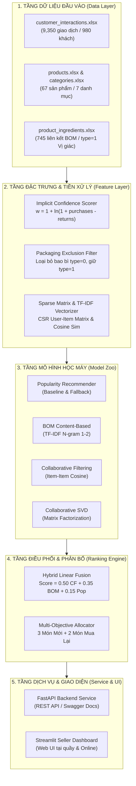

# 🍵 Hương Vân Trà — Personalized Tea Recommender System (v1.1)

[](https://www.python.org/)
[](https://fastapi.tiangolo.com)
[](https://streamlit.io)
[]()
[]()

> **Hệ thống AI đề xuất sản phẩm trà cá nhân hóa thông minh** dành cho chuỗi thương hiệu **Hương Vân Trà**, kết hợp **Lọc cộng tác (Collaborative Filtering)**, **Khai phá cấu trúc nguyên liệu vị giác (BOM Content-Based)** và **Mô hình lai đa mục tiêu (Hybrid Multi-Objective)** nhằm giải quyết bài toán tư vấn bán hàng đa mục tiêu (*Khám phá món mới vs. Mua lại định kỳ*) trong thời gian thực (< 50ms).

---

## 📌 Mục Lục

1. [Điểm Nổi Bật & Giá Trị Kinh Doanh](#-điểm-nổi-bật--giá-trị-kinh-doanh)
2. [Kiến Trúc Tổng Thể (Clean Architecture)](#-kiến-trúc-tổng-thể-clean-architecture)
3. [Các Pipeline Hoạt Động Cốt Lõi](#-các-pipeline-hoạt-động-cốt-lõi)
4. [Tầng Mô Hình Học Máy (Model Zoo)](#-tầng-mô-hình-học-máy-model-zoo)
5. [Kết Quả Đánh Giá Thực Nghiệm (Offline Benchmark)](#-kết-quả-đánh-giá-thực-nghiệm-offline-benchmark)
6. [Quy Chuẩn Dữ Liệu & Tiền Xử Lý](#-quy-chuẩn-dữ-liệu--tiền-xử-lý)
7. [Tech Stack](#-tech-stack)
8. [Hướng Dẫn Cài Đặt & Khởi Chạy](#-hướng-dẫn-cài-đặt--khởi-chạy)
9. [Tài Liệu API (Endpoints)](#-tài-liệu-api-endpoints)
10. [Cấu Trúc Thư Mục](#-cấu-trúc-thư-mục)

---

## 🌟 Điểm Nổi Bật & Giá Trị Kinh Doanh

- **Độ chính xác ấn tượng**: Recall@5 đạt **47.06%**, NDCG@5 đạt **0.3864**, Precision@5 đạt **18.72%**, Catalog Coverage đạt **75.00%** trên tập dữ liệu giao dịch thực tế gồm 9,350 tương tác của 980 khách hàng.
- **Chiến lược đa mục tiêu (Multi-Objective)**: Tự động phân bổ linh hoạt **3 slot Khám Phá Mới** (*New Discovery*) theo gu tương đồng và **2 slot Mua Lại Định Kỳ** (*Repeat Purchase*) theo chu kỳ tiêu dùng trà.
- **Giải quyết triệt để Cold-Start**:
  - *Sản phẩm mới ra mắt*: Khai thác định mức nguyên liệu BOM (hoa sen, nhài, bưởi, trà cổ thụ...) để gợi ý ngay ngày đầu mở bán.
  - *Khách hàng mới toanh*: Kích hoạt chốt chặn an toàn **Popularity Fallback** theo danh mục sản phẩm.
- **Explainability (Minh bạch lý do)**: Cung cấp mã lý do gợi ý rõ ràng (`SIMILAR_TASTE_PROFILE`, `PREVIOUS_FAVORITE`, `HIGH_PURCHASE_FREQUENCY`) giúp nhân viên tư vấn dễ dàng thuyết phục khách hàng.
- **Sẵn sàng vận hành**: Đi kèm đầy đủ REST API (FastAPI) tốc độ cao (< 50ms) và giao diện Web trực quan (Streamlit) cho nhân viên bán hàng tại quầy.

---

## 🏛 Kiến Trúc Tổng Thể (Clean Architecture)

Hệ thống được tổ chức phân tầng độc lập, bảo đảm tính module hóa, dễ kiểm thử và mở rộng:



---

## 🔄 Các Pipeline Hoạt Động Cốt Lõi

### Pipeline 1: Xử Lý Dữ Liệu & Trích Xuất Đặc Trưng BOM
- **Quy tắc tiền xử lý bắt buộc (Packaging Exclusion)**: Lọc triệt để các vật tư đóng gói (`type=0` như túi zip, hộp thiếc, nơ, tem nhãn) khỏi bảng BOM, chỉ giữ lại nguyên liệu tạo hương vị thực tế (`type=1` như hoa sen, hoa nhài, trà xanh Tân Cương, quế chi...). Việc này loại bỏ hiện tượng ô nhiễm không gian vector và sụp đổ phân giải độ tương đồng TF-IDF.
- **Implicit Interaction Scorer**: Chuyển đổi số lượt mua và hoàn trả thành độ tin cậy tương tác ngầm:
  $$w_{u, i} = 1.0 + \ln(1 + \max(0, \text{purchases} - \text{returns}))$$

### Pipeline 2: Huấn Luyện Ngoại Tuyến & Leave-K-Out Split
- Áp dụng chiến lược chia tập kiểm thử thời gian thực nghiệm **Leave-K-Out (80% Train / 20% Test)**.
- Đánh giá độc lập trên 1,921 tương tác kiểm thử với các độ đo Top-5: Recall@5, Precision@5, NDCG@5, MAP@5, Catalog Coverage.

### Pipeline 3: Suy Luận Thời Gian Thực & Phân Bổ Đa Mục Tiêu
- Khi nhận yêu cầu với mã `customer_id`:
  - Nếu là khách quen: Kết hợp điểm từ Item-Item CF, Content-Based BOM và Popularity; phân bổ 3 slot món mới + 2 slot mua lại (hoặc 100% món mới nếu bật cờ `exclude_purchased`).
  - Nếu là khách mới tinh: Tự động Fallback sang danh sách sản phẩm bán chạy nhất trong danh mục.

---

## 🤖 Tầng Mô Hình Học Máy (Model Zoo)

| Mô hình | Nguyên lý hoạt động | Vai trò chính |
|:---|:---|:---|
| **Popularity** | Đếm tổng trọng số tương tác của sản phẩm trên toàn hệ thống | Chốt chặn an toàn (Cold-Start Fallback) |
| **Content-Based BOM** | TF-IDF N-gram (1,2) trên nguyên liệu vị giác + Cosine Similarity | Giải quyết Item Cold-Start khi ra mắt trà mới |
| **Item-Item CF** | Đo lường đồng xuất hiện mua sắm giữa các cặp sản phẩm | Bắt trúng sở thích của khách quen |
| **SVD Matrix Factorization** | Phân rã ma trận tương tác sang $k=12$ chiều tiềm ẩn | Nắm bắt các trục gu vị giác ẩn |
| **Hybrid Recommender (v1.1)** | Tổ hợp tuyến tính có trọng số giữa Item-Item CF, BOM và Popularity | Đạt cân bằng tối ưu giữa độ chính xác và khám phá |

---

## 📊 Kết Quả Đánh Giá Thực Nghiệm (Offline Benchmark)

Toàn bộ các mô hình được đánh giá đối đầu trên tập Test gồm 1,921 tương tác thực tế từ 980 khách hàng tại Top-5:

| STT | Mô Hình / Thuật Toán | Recall@5 | Precision@5 | NDCG@5 | MAP@5 | Catalog Coverage |
|:---:|:---|:---:|:---:|:---:|:---:|:---:|
| 1 | **Popularity (Baseline)** | 30.02% | 12.28% | 0.2395 | 0.1794 | 31.25% |
| 2 | **Content-Based (BOM TF-IDF)** | 24.99% | 10.05% | 0.1980 | 0.1444 | **95.31%** |
| 3 | **Collaborative (Item-Item CF)** | **48.95%** | **19.51%** | **0.4050** | **0.3239** | 78.12% |
| 4 | **Collaborative (SVD Factorization)** | 32.68% | 13.61% | 0.2755 | 0.2135 | 84.38% |
| 5 | 🏆 **Hybrid Recommender (v1.1)** | 47.06% | 18.72% | 0.3864 | 0.3071 | 75.00% |

---

## 🗃 Quy Chuẩn Dữ Liệu & Tiền Xử Lý

Dữ liệu đầu vào đặt tại thư mục `data/` bao gồm 6 bảng Excel quan hệ:

1. `categories.xlsx`: 7 danh mục trà (Trà ướp hoa, Ô long, Thảo mộc, Trà xanh, Trà trái cây, Hộp quà, Túi lọc).
2. `products.xlsx`: 67 sản phẩm trà nền (lọc `status == 'ACTIVE'`).
3. `product_variants.xlsx`: 127 biến thể SKU đóng gói (hộp 100g, hũ thiếc) và khoảng giá bán min-max.
4. `ingredients.xlsx`: 61 nguyên liệu (`type=1`: vị giác, `type=0`: bao bì phụ liệu).
5. `product_ingredients.xlsx`: 745 dòng định mức BOM liên kết sản phẩm và nguyên liệu (`is_active_bom == 1`).
6. `customer_interactions.xlsx`: 9,350 bản ghi tương tác của 980 khách hàng trên 60 sản phẩm (mật độ 15.9%).

---

## 🛠 Tech Stack

- **Ngôn ngữ**: Python 3.10+ (đã kiểm thử và tương thích hoàn toàn Python 3.12, 3.13)
- **API & Dịch vụ**: FastAPI, Uvicorn, Pydantic v2
- **Dashboard Web**: Streamlit
- **Khoa học dữ liệu & ML**: Scikit-Learn, SciPy, NumPy, Pandas
- **Kiểm thử tự động**: PyTest, PyTest-Asyncio, HTTPX
- **Báo cáo kỹ thuật**: Playwright, KaTeX, Mermaid.js

---

## 🚀 Hướng Dẫn Cài Đặt & Khởi Chạy

### 1. Cài đặt môi trường

```bash
# Clone dự án từ GitHub
git clone https://github.com/cakho6179/Recommend_Tra.git
cd Recommend_Tra

# Tạo môi trường ảo (khuyên dùng)
python -m venv venv
source venv/bin/activate  # Trên Linux/macOS
# hoặc trên Windows: .\venv\Scripts\activate

# Cài đặt toàn bộ thư viện cần thiết
pip install -r requirements.txt
```

### 2. Chuẩn bị Dữ liệu (Data Setup)

Copy 6 file Excel vào thư mục `data/`:
- `data/categories.xlsx`
- `data/products.xlsx`
- `data/product_variants.xlsx`
- `data/ingredients.xlsx`
- `data/product_ingredients.xlsx`
- `data/customer_interactions.xlsx`

### 3. Chạy Demo Giao Diện Web (Streamlit Seller Dashboard)

```bash
python scripts/run_demo.py
# hoặc:
streamlit run src/app/streamlit_app.py
```
👉 Truy cập giao diện tại: **`http://localhost:8501`**

### 4. Khởi chạy REST API Service (FastAPI)

```bash
python scripts/run_api.py
# hoặc:
uvicorn src.service.api:app --host 0.0.0.0 --port 8000 --reload
```
👉 Xem tài liệu Swagger UI tại: **`http://localhost:8000/docs`**

### 5. Chạy Đánh Giá Benchmark Dòng Lệnh

```bash
python scripts/train_and_evaluate.py
```

### 6. Chạy Kiểm Thử Toàn Bộ (Test Suite)

```bash
python -m pytest tests/ -v
```
*(Tất cả 27/27 unit & integration tests đều vượt qua thành công).*

---

## 📡 Tài Liệu API (Endpoints)

### 1. `POST /recommendations/customer`
Gợi ý cá nhân hóa cho khách hàng quen.

**Request Body:**
```json
{
  "customer_id": "014f08dc-e5cf-4df5-aa83-65231c62f2f7",
  "limit": 5,
  "exclude_purchased": false
}
```

**Response (200 OK):**
```json
{
  "customer_id": "014f08dc-e5cf-4df5-aa83-65231c62f2f7",
  "source": "MODEL",
  "recommendations": [
    {
      "rank": 1,
      "product_id": "p_01",
      "product_code": "TRA_NHAI_01",
      "product_name": "Trà Nhài Truyền Thống",
      "category_name": "Trà ướp hoa",
      "score": 0.952,
      "recommendation_type": "REPEAT_PURCHASE",
      "reason_code": "HIGH_PURCHASE_FREQUENCY",
      "min_price": 120000,
      "max_price": 250000
    },
    {
      "rank": 2,
      "product_id": "p_05",
      "product_code": "TRA_CUC_01",
      "product_name": "Trà Xanh Hoa Cúc",
      "category_name": "Trà ướp hoa",
      "score": 0.696,
      "recommendation_type": "NEW_DISCOVERY",
      "reason_code": "SIMILAR_TASTE_PROFILE",
      "min_price": 95000,
      "max_price": 180000
    }
  ]
}
```

### 2. `POST /recommendations/guest`
Gợi ý cho khách vãng lai / khách mới tinh theo danh mục bán chạy.

**Request Body:**
```json
{
  "category_id": "cat_01",
  "limit": 5
}
```

### 3. `GET /health`
Kiểm tra sức khỏe hệ thống và trạng thái nạp dữ liệu.

---

## 📁 Cấu Trúc Dự Án

```text
Recommend_Tra/
├── data/                                 # [copy vào đây] 6 bảng dữ liệu Excel thực tế (.xlsx)
│   ├── categories.xlsx                   # Danh mục hương vị trà
│   ├── products.xlsx                     # Danh mục sản phẩm active
│   ├── product_variants.xlsx             # Biến thể SKU và đơn giá
│   ├── ingredients.xlsx                  # Bảng phân định nguyên liệu / bao bì
│   ├── product_ingredients.xlsx          # Định mức BOM liên kết sản phẩm - nguyên liệu
│   └── customer_interactions.xlsx        # 9,350 giao dịch thực tế của 980 khách hàng
├── docs/                                 # Tài liệu kỹ thuật chuyên sâu
│   ├── architecture/system_design.md     # Thiết kế kiến trúc Clean Architecture
│   ├── reports/                          # Báo cáo kỹ thuật chuẩn PDF & HTML
│   │   ├── Personalized_Tea_Recommender_System_Report.html
│   │   └── Personalized_Tea_Recommender_System_Report.pdf
│   └── research/                         # Khảo sát SOTA Feedback Loop & Continual Learning
│       └── recommendation_feedback_loop_sota.md
├── src/                                  # Mã nguồn module hóa Clean Architecture
│   ├── config.py                         # Cấu hình trọng số và siêu tham số
│   ├── data/                             # Nạp, tiền xử lý, chia train/test
│   ├── models/                           # Model Zoo (Popularity, Content-Based, Item-Item CF, SVD, Hybrid)
│   ├── evaluation/                       # Chỉ số đo lường Recall, NDCG, MAP, Coverage
│   ├── service/                          # Engine suy luận, FastAPI app, Schemas
│   └── app/                              # Giao diện Streamlit Dashboard
├── scripts/                              # Kịch bản thực thi tác vụ
│   ├── train_and_evaluate.py             # Chạy benchmark & demo console
│   ├── run_api.py                        # Chạy FastAPI REST API Server
│   ├── run_demo.py                       # Chạy Streamlit Dashboard
│   └── generate_report_pdf.py            # Biên dịch báo cáo PDF vector
├── requirements.txt                      # Danh mục dependencies sản phẩm
└── README.md                             # Tài liệu hướng dẫn sử dụng dự án
```

---

## 📄 Bản Quyền & Giấy Phép

Phát triển bởi đội ngũ kỹ sư AI phục vụ dự án chuyển đổi số bán lẻ **Hương Vân Trà**. Phát hành theo giấy phép [MIT License](LICENSE).
