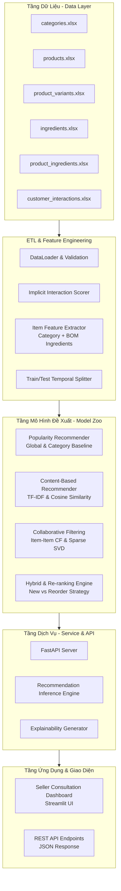

# Hệ Thống Cá Nhân Hóa Đề Xuất Trà (Personalized Tea Recommender System)
## Tài Liệu Thiết Kế Hệ Thống Chi Tiết (System Design Document v1.0)

---

## 1. Tổng Quan & Bối Cảnh Nghiệp Vụ

### 1.1. Vấn đề giải quyết
Trong ngành bán lẻ trà cao cấp và trà thảo mộc, khách hàng có nhu cầu thưởng thức đa dạng nhưng nhân viên bán hàng (seller) thường gặp khó khăn:
- Không nhớ được lịch sử và khẩu vị riêng của từng khách hàng.
- Thiếu cơ sở dữ liệu và công cụ để đề xuất sản phẩm mới phù hợp với gu thưởng trà của khách.
- Khó xác định đúng thời điểm và sản phẩm khách hàng có nhu cầu mua lại (*Repeat Purchase*).
- Thời gian tư vấn lâu, phụ thuộc vào trực giác và kinh nghiệm cá nhân của từng nhân viên.

### 1.2. Mục tiêu hệ thống
Hệ thống **Personalized Tea Product Recommendation Engine** sinh ra để:
1. Nhận diện khách hàng (`customer_id`) hoặc xử lý khách hàng mới chưa có tài khoản (*Cold-start*).
2. Tự động sinh danh sách **Top 5 sản phẩm trà phù hợp nhất** cho seller tư vấn trong thời gian dưới 100ms.
3. Cung cấp **Explainability (Lời giải thích lý do đề xuất)**: Giải thích vì sao sản phẩm này được gợi ý (ví dụ: *Cùng dòng Trà xanh*, *Có thành phần Hoa nhài tương tự loại bạn hay uống*, *Sản phẩm bán chạy nhất cùng phân khúc*).
4. Phân chia rõ ràng giữa **Khám phá mới (New Product Discovery)** và **Mua lại định kỳ (Repeat Purchase)**.
5. Thiết kế kiến trúc mở (modular & extensible) để dễ dàng tích hợp thêm tầng **Cá nhân hóa công thức (Recipe Personalization)** trong tương lai khi có đủ dữ liệu định lượng gram nguyên liệu.

---

## 2. Kiến Trúc Tổng Thể (System Architecture)



---

## 3. Thiết Kế Chi Tiết Từng Module

### 3.1. Module Dữ Liệu & Tiền Xử Lý (`src/data/`)

#### 3.1.1. Chuẩn hóa ma trận tương tác ngầm (Implicit Feedback Scoring)
Dữ liệu tương tác thực tế từ `customer_interactions.xlsx` ghi nhận:
- `total_purchase_count` ($P_c$)
- `total_purchase_quantity` ($P_q$)
- `total_return_count` ($R_c$)
- `total_return_quantity` ($R_q$)
- `last_interaction_time` ($T$)

Ta tính điểm tin cậy tương tác (Implicit Confidence Score) $r_{u, i}$ giữa khách hàng $u$ và sản phẩm $i$:
$$
r_{u, i} = \log_2\left(1 + 2 \cdot P_c + P_q - 3 \cdot R_c - 1.5 \cdot R_q\right) \times \text{decay}(T)
$$
Trong đó:
- $\text{decay}(T)$ là hệ số suy giảm theo thời gian tương tác gần nhất (recency decay):
  $$\text{decay}(T) = \exp\left(-\lambda \cdot \frac{\Delta t}{365}\right)$$
- Điểm số được chặn dưới $r_{u, i} \ge 0$.

#### 3.1.2. Trích xuất đặc trưng sản phẩm (Item Profile Feature Vector)
Từ `categories.xlsx`, `products.xlsx`, `ingredients.xlsx`, và `product_ingredients.xlsx`:
1. Lọc các nguyên liệu có giá trị hương vị (`type = 1`), loại bỏ bao bì đóng gói (`type = 0` như túi zip, hộp giấy, nơ).
2. Tạo chuỗi văn bản biểu diễn sản phẩm (Item Text Representation):
   `Text(i) = [Tên Danh Mục] + [Tên Sản Phẩm] + [Danh sách tên nguyên liệu type 1]`
3. Vector hóa đặc trưng sản phẩm bằng TF-IDF có gắn trọng số:
   $$\vec{v}_i = \text{TF-IDF}(\text{Text}(i))$$
4. Tính ma trận độ tương đồng nội dung giữa các sản phẩm:
   $$S_{\text{content}}(i, j) = \frac{\vec{v}_i \cdot \vec{v}_j}{\|\vec{v}_i\| \|\vec{v}_j\|}$$

---

### 3.2. Module Mô Hình Đề Xuất (`src/models/`)

#### 3.2.1. Model 1: Popularity Recommender (Baseline & Cold-start)
- **Cơ chế:** Tính tổng số lượng bán và tần suất mua trên toàn hệ thống hoặc theo từng danh mục.
- **Vai trò:** Fallback tin cậy tuyệt đối khi gặp khách hàng mới (*Cold-start Customer*) chưa có dữ liệu giao dịch.

#### 3.2.2. Model 2: Content-Based Recommender
- **Cơ chế:** Với khách hàng $u$ đã từng tương tác với tập sản phẩm $I_u$ cùng trọng số $r_{u, j}$, điểm phù hợp của sản phẩm ứng viên $i \notin I_u$:
  $$Score_{\text{CB}}(u, i) = \frac{\sum_{j \in I_u} r_{u, j} \cdot S_{\text{content}}(i, j)}{\sum_{j \in I_u} r_{u, j}}$$
- **Ưu điểm:** Khám phá tốt các sản phẩm mới có thành phần/vị trà tương tự mà không cần lượng lớn tương tác từ cộng đồng.

#### 3.2.3. Model 3: Collaborative Filtering (Item-Item CF & Matrix Factorization)
- **Cơ chế:**
  - **Item-based CF:** Dựa trên ma trận tương tác $R$ kích thước $U \times I$, tính tương đồng hành vi giữa 2 sản phẩm:
    $$S_{\text{CF}}(i, j) = \text{Cosine}(R_{*, i}, R_{*, j})$$
    Dự đoán điểm của khách $u$ cho sản phẩm $i$:
    $$Score_{\text{CF}}(u, i) = \sum_{j \in I_u} r_{u, j} \cdot S_{\text{CF}}(i, j)$$
  - **Matrix Factorization (TruncatedSVD / ALS):** Phân rã ma trận ẩn $R \approx U_k \Sigma_k V_k^T$ để tìm biểu diễn latent vector cho User và Item.

#### 3.2.4. Model 4: Hybrid Recommender & Multi-Objective Ranking
Kết hợp đa mô hình và tối ưu hóa đồng thời 2 mục tiêu:
1. **Điểm số Hybrid tuyến tính:**
   $$Score(u, i) = w_1 \cdot \widehat{Score}_{\text{CF}}(u, i) + w_2 \cdot \widehat{Score}_{\text{CB}}(u, i) + w_3 \cdot \widehat{Score}_{\text{Pop}}(i)$$
2. **Chiến lược phân bổ Top 5 (Discovery vs Reorder Strategy):**
   - **Tỷ lệ đề xuất mặc định:** 3 sản phẩm Khám phá mới (*New Discovery*) + 2 sản phẩm Mua lại (*Repeat Purchase*).
   - Nếu khách hàng có ít hơn 2 sản phẩm mua lại phù hợp, tự động lấp đầy bằng các sản phẩm khám phá mới tốt nhất.
   - Nếu khách hàng mới tinh (0 tương tác), 100% Top 5 là sản phẩm bán chạy nhất theo đa dạng danh mục (Diversity Fallback).

---

### 3.3. Module Đánh Giá & Benchmark (`src/evaluation/`)

Hệ thống đánh giá trên tập kiểm thử (Test Split) với các chỉ số tiêu chuẩn công nghiệp:
- **Recall@5:** Tỷ lệ sản phẩm khách thực tế mua nằm trong Top 5 đề xuất.
- **Precision@5:** Tỷ lệ chính xác của 5 sản phẩm đề xuất.
- **NDCG@5:** Đo lường chất lượng xếp hạng (vị trí càng cao điểm thưởng càng lớn).
- **MAP@5 (Mean Average Precision):** Độ chính xác trung bình có trọng số vị trí.
- **Catalog Coverage:** Tỷ lệ % số sản phẩm trong kho được hệ thống đề xuất ít nhất một lần.
- **Novelty / Diversity:** Độ đa dạng danh mục trong danh sách gợi ý.

---

### 3.4. Module Dịch Vụ & Suy Luận (`src/service/`)

#### 3.4.1. Cấu trúc Response API (Pydantic Schema)
```json
{
  "customer_id": "014f08dc-741f-ab40-4eb2-fcc081858e0a",
  "is_cold_start": false,
  "top_k": 5,
  "recommendations": [
    {
      "rank": 1,
      "product_id": "01ecc072-cb6c-7314-1e78-628e5c4888f4",
      "product_code": "LFM_TRA_NHAI",
      "product_name": "Trà Nhài Truyền Thống",
      "category_name": "Trà ướp hoa",
      "recommendation_type": "REPEAT_PURCHASE",
      "score": 0.942,
      "reason_code": "HIGH_PURCHASE_FREQUENCY",
      "explanation": "Khách hàng đã mua sản phẩm này 3 lần và có độ hài lòng cao.",
      "min_price": 95000,
      "max_price": 180000,
      "key_ingredients": ["Hoa nhài", "Trà xanh"]
    },
    {
      "rank": 2,
      "product_id": "016a1a81-27c5-268f-f943-4fa3132822a6",
      "product_code": "LFM_TRA_XANH_HOA_CUC",
      "product_name": "Trà Xanh Hoa Cúc",
      "category_name": "Trà xanh",
      "recommendation_type": "NEW_DISCOVERY",
      "score": 0.885,
      "reason_code": "SIMILAR_TASTE_PROFILE",
      "explanation": "Có thành phần Trà xanh tương đồng với các sản phẩm bạn yêu thích.",
      "min_price": 125000,
      "max_price": 250000,
      "key_ingredients": ["Hoa cúc", "Trà xanh"]
    }
  ]
}
```

#### 3.4.2. API Endpoints
- `GET /api/v1/health`: Kiểm tra sức khỏe dịch vụ và thông tin phiên bản mô hình.
- `GET /api/v1/recommendations/{customer_id}`: Trả về Top K gợi ý cá nhân hóa cho một khách hàng.
- `POST /api/v1/recommendations/guest`: Gợi ý cho khách vãng lai dựa trên form lựa chọn danh mục hoặc khẩu vị nhanh.
- `GET /api/v1/customers/{customer_id}/history`: Lấy tóm tắt lịch sử mua hàng của khách.
- `GET /api/v1/products`: Tra cứu danh mục sản phẩm trà và biến thể.

---

### 3.5. Module Giao Diện Trực Quan (Streamlit Seller UI)
Màn hình chuyên biệt dành cho Nhân Viên Bán Hàng (Seller):
1. **Ô tìm kiếm & chọn Khách Hàng:** Gõ mã hoặc chọn từ danh sách khách hàng.
2. **Thẻ thông tin khách:** Số lần mua, tổng số lượng trà đã mua, các sản phẩm ưa chuộng nhất.
3. **Bảng Top 5 Đề Xuất Trà Cá Nhân Hóa:**
   - Huy hiệu rõ ràng: `Mua Lại (Reorder)` hoặc `Khám Phá Mới (New Discovery)`.
   - Điểm số độ khớp (Relevance Match).
   - Thẻ thành phần nguyên liệu nổi bật.
   - Lý do tư vấn hiển thị bằng tiếng Việt tự nhiên giúp nhân viên đọc ngay khi nói chuyện với khách.
4. **Tab Khách Hàng Mới (Cold-start Tester):** Cho phép nhân viên bấm chọn gu vị của khách (ví dụ: *Thích hương hoa*, *Thích vị đậm*) để hệ thống trả về ngay danh sách trà phù hợp.

---

## 4. Khả Năng Mở Rộng Cho Phase 2 (Recipe Personalization)

Khi doanh nghiệp triển khai việc thu thập định lượng gram nguyên liệu trong bảng `product_ingredients` (ví dụ bổ sung cột `quantity_g`, `ratio_pct`) và form thu thập khảo sát khẩu vị khách hàng (độ ngọt, độ đậm, hương hoa thang điểm 1-5):
1. Tầng **Recipe Recommender** sẽ nhận đầu ra `product_id` từ Tầng 1 (Product Recommender).
2. Tầng **Constraint Validator** sẽ kiểm tra số gram từng nguyên liệu xem có thỏa mãn ràng buộc tỉ lệ và tồn kho hay không.
3. Kiến trúc hướng module (`src/models/` và `src/service/`) cho phép gắn thêm `RecipeRecommender` vào pipeline mà không cần viết lại toàn bộ hệ thống.
